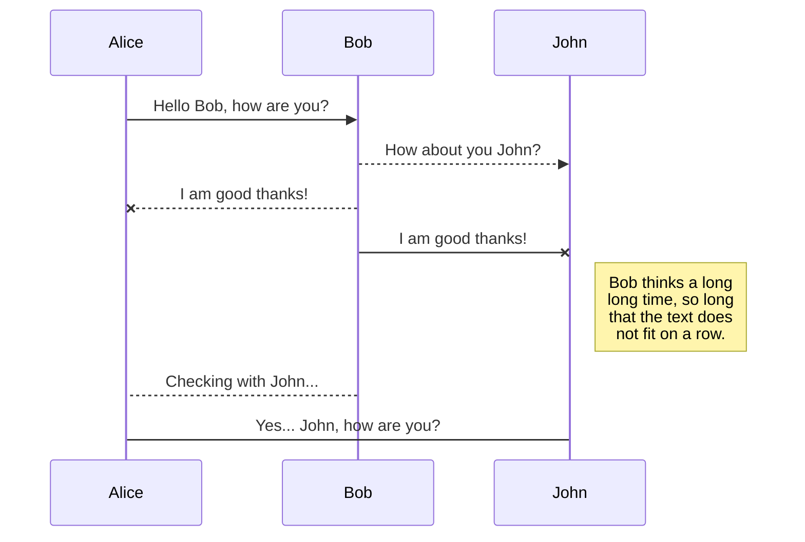
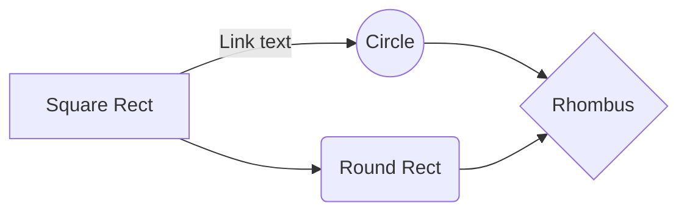

# Markdown-cheatsheet
Best Markdown cheat sheet ever made with HTML


## Best IDE

- [stackedit](https://stackedit.io/)
- [readme so](https://readme.so/editor)
- [markdown to html](https://readme.so/editor)


## 🔗 Youtube Video Links
[](#)


## Index


| components name | link     | language  (html+markdown)              |
| :-------- | :------- | :------------------------- |
| `Headings` | [view]() | html+markdown |
| `text style` | [view]() | html+markdown |
| `Horizontal Rule` | [View]() | html+markdown |
| `Links` | [View]() | html+markdown |
| `List` | [View]() | html+markdown |
| `Inline Code Block` | [View]() | html+markdown |
| ` Images` | [View]() | html+markdown |
| `Github code Markdown` | [View]() | html+markdown |


# Headings 

<!--HTML heading-->
<h1> heading 1 </h1>
<h2> heading 2</h2>
<h3> heading 3</h3>
<h4> heading 4</h4>
<h5> heading 5</h5>
<h6> heading 6</h6>

<!--Markdown heading -->
# heading 1
## heading 2
### heading 3
#### heading 4
##### heading 5
###### heading 


<!-- Italics -->

<!--HTML Italics -->
This is a <i>Italic </i> text 
<!--Markdown Italics -->
This is a *Italic* text 

<!-- Strong -->
**This text** is italic

__This text__ is italic

<!--HTML bold -->
This is a <b>bold </b> text 

<!--Markdown Bold -->
This is a **bold** text 

<!-- Blockquote -->
> This is a quote

<!-- Strikethrough -->
~~This text~~ is strikethrough

# Horizontal Rule

<!--HTML  Horizontal Rule-->

<hr>
<!--Markdown Horizontal Rule-->

---
___


<!-- Links -->
[The Terminal Boy](https://www.youtube.com/c/TheTerminalBoy)


 # List (order unorder )
 <p> order list </p>
<!--HTML  OL-->
<ol>
<li>this is one</li>
<li>this is two</li>
<li>this is three</li>
</ol>

<!--Markdown OL-->

 - this is one 
 - this is two 
 - this is three

 <p> Un order list </p>
<!--HTML  UL-->
<ul>
<li>this is one</li>
<li>this is two</li>
<li>this is three</li>
</ul>

<!--Markdown UL-->

- Item 1
- item 2
- Item 3
  - Nested item 4
  - Nested Item 5

<!-- Inline Code Block -->
`<p>This is a paragraph</p>`

<!-- Images -->
# Images

<!--HTML  Images-->
 

<!--Markdown img-->


<!-- Github Markdown -->

<!-- Code Blocks -->
```bash
  npm install

  npm start
```

```javascript
  function add(num1, num2) {
    return num1 + num2;
  }
```

```python
  def add(num1, num2):
    return num1 + num2
```

<!-- Tables -->
# Table 
<!--HTML  table-->
<p> Table </p>
<table border="1">
<tr>
<td>1</td>
<td>2</td>
<td>3</td>
<tr>
<tr>
<td>4</td>
<td>5</td>
<td>6</td>
<tr>
</table>

<br>
<!--Markdown table-->

| name | ID |
|---|----|
|rahul| 2000 |
|rahul| 2000 | 
|rahul| 2000 | 


<!-- Task List -->
* [x] Task 1
* [x] Task 2
* [ ] Task 3


## SmartyPants

SmartyPants converts ASCII punctuation characters into "smart" typographic punctuation HTML entities. For example:

|                |ASCII                          |HTML                         |
|----------------|-------------------------------|-----------------------------|
|Single backticks|`'Isn't this fun?'`            |'Isn't this fun?'            |
|Quotes          |`"Isn't this fun?"`            |"Isn't this fun?"            |
|Dashes          |`-- is en-dash, --- is em-dash`|-- is en-dash, --- is em-dash|

## Github math 
When $a \ne 0$, there are two solutions to $(ax^2 + bx + c = 0)$ and they are 
$$ x = {-b \pm \sqrt{b^2-4ac} \over 2a} $$


## KaTeX

You can render LaTeX mathematical expressions using [KaTeX](https://khan.github.io/KaTeX/):

The *Gamma function* satisfying $\Gamma(n) = (n-1)!\quad\forall n\in\mathbb N$ is via the Euler integral

$$
\Gamma(z) = \int_0^\infty t^{z-1}e^{-t}dt\,.
$$

> You can find more information about **LaTeX** mathematical expressions [here](http://meta.math.stackexchange.com/questions/5020/mathjax-basic-tutorial-and-quick-reference).


## UML diagrams

You can render UML diagrams using [Mermaid](https://mermaidjs.github.io/). For example, this will produce a sequence diagram:



And this will produce a flow chart:

[Visit Doc](https://rich-iannone.github.io/DiagrammeR/mermaid.html)



