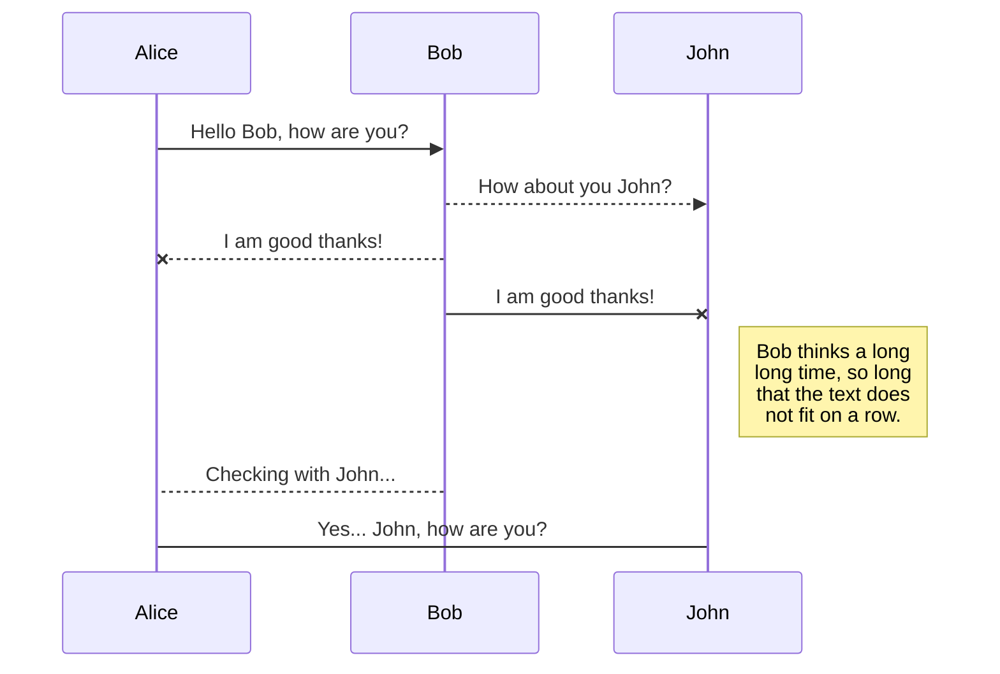
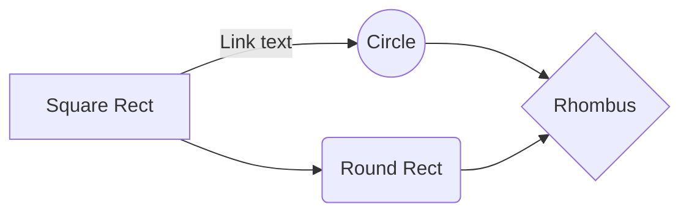

# Markdown-cheatsheet
Best Markdown cheat sheet ever made with HTML


## Best IDE

- [stackedit](https://stackedit.io/)
- [readme so](https://readme.so/editor)
- [markdown to html](https://readme.so/editor)


## 🔗 Youtube Video Links
[](#)


## Index


| components name | link     | language  (html+markdown)              |
| :-------- | :------- | :------------------------- |
| `Headings` | [view]() | html+markdown |
| `text style` | [view]() | html+markdown |
| `Horizontal Rule` | [View]() | html+markdown |
| `Links` | [View]() | html+markdown |
| `List` | [View]() | html+markdown |
| `Inline Code Block` | [View]() | html+markdown |
| ` Images` | [View]() | html+markdown |
| `Github code Markdown` | [View]() | html+markdown |


<!-- Headings -->
# Heading 1
## Heading 2
### Heading 3
#### Heading 4
##### Heading 5
###### Heading 6

<!-- Italics -->
*This text* is italic

_This text_ is italic

<!-- Strong -->
**This text** is italic

__This text__ is italic

<!-- Blockquote -->
> This is a quote

<!-- Strikethrough -->
~~This text~~ is strikethrough

<!-- Horizontal Rule -->

---
___


<!-- Links -->
[The Terminal Boy](https://www.youtube.com/c/TheTerminalBoy)


<!-- UL -->
* Item 1
* Item 2
* Item 3
  * Nested Item 1
  * Nested Item 2

<!-- OL -->
1. Item 1
1. Item 2
1. Item 3

<!-- Inline Code Block -->
`<p>This is a paragraph</p>`

<!-- Images -->


<!-- Github Markdown -->

<!-- Code Blocks -->
```bash
  npm install

  npm start
```

```javascript
  function add(num1, num2) {
    return num1 + num2;
  }
```

```python
  def add(num1, num2):
    return num1 + num2
```

<!-- Tables -->
| Name     | Email          |
| -------- | -------------- |
| John Doe | john@gmail.com |
| Jane Doe | jane@gmail.com |

<!-- Task List -->
* [x] Task 1
* [x] Task 2
* [ ] Task 3


## SmartyPants

SmartyPants converts ASCII punctuation characters into "smart" typographic punctuation HTML entities. For example:

|                |ASCII                          |HTML                         |
|----------------|-------------------------------|-----------------------------|
|Single backticks|`'Isn't this fun?'`            |'Isn't this fun?'            |
|Quotes          |`"Isn't this fun?"`            |"Isn't this fun?"            |
|Dashes          |`-- is en-dash, --- is em-dash`|-- is en-dash, --- is em-dash|


## KaTeX

You can render LaTeX mathematical expressions using [KaTeX](https://khan.github.io/KaTeX/):

The *Gamma function* satisfying $\Gamma(n) = (n-1)!\quad\forall n\in\mathbb N$ is via the Euler integral

$$
\Gamma(z) = \int_0^\infty t^{z-1}e^{-t}dt\,.
$$

> You can find more information about **LaTeX** mathematical expressions [here](http://meta.math.stackexchange.com/questions/5020/mathjax-basic-tutorial-and-quick-reference).


## UML diagrams

You can render UML diagrams using [Mermaid](https://mermaidjs.github.io/). For example, this will produce a sequence diagram:



And this will produce a flow chart:



